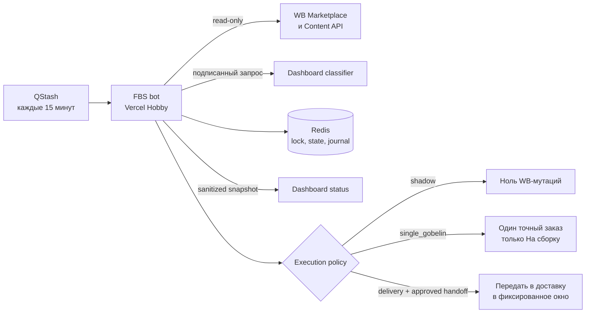

# Отчёт: автономный FBS-бот ИП Зубахина

Дата: 2026-08-12
Риск: R3 для shadow-релиза, R4 для включения реальных WB-мутаций

## Цель и критерии

- Каждые 15 минут читать новые FBS-заказы и классифицировать их по актуальному маппингу Dashboard.
- Группировать только совместимые заказы по товару, ткани, складу, офису назначения и служебным WB-признакам.
- Поддержать фиксированные окна доставки `05:00`, `10:00`, `15:00`, `20:00` по Москве.
- Не обрабатывать blacklist, неизвестные категории, неоднозначные ткани и неподтверждённые требования.
- Перед каждой WB-мутацией вести журнал, а результат подтверждать свежим чтением WB.
- Первый реальный тест ограничить одним выбранным гобеленом и только операцией «На сборку».

## Схема

## Роли

- Оркестратор и интегратор: Codex root agent.
- Реализация: изолированные task-агенты и root agent.
- Независимая проверка: `final_safety_review`, `wb_contract_fix_review`.
- Проверка Dashboard-релиза: `dashboard_release_check`.

## Изменения

- Отдельный Next.js/TypeScript-бот: WB-клиент, классификатор, Redis state machine, mutation journal, reconciliation, QStash route, preflight и регистрация расписания.
- Dashboard: подписанные internal classifier/status endpoints, Redis snapshot и admin-only вкладка состояния.
- Безопасность пилота: `single_gobelin` требует точный `orderId`, свежую классификацию `гобелен`, свежую совместимость и подтверждённую handoff policy.
- Crash recovery: attempt-2 не дублирует неизвестную мутацию, базовый и retry-журналы закрываются только по доказанному результату.
- Схемы базы данных не менялись. Redis использует версионированные записи и CAS; удаление production-данных не выполнялось.

## Проверка

| Проверка | Команда или сценарий | Результат |
|---|---|---|
| Bot logic | `npm test` | VERIFIED: 300/300 |
| Bot types/lint/build | `npx tsc --noEmit && npm run lint && npm run build` | VERIFIED |
| Dashboard logic | `npm run test:unit` | VERIFIED: 55/55 |
| Dashboard lint/build | `npm run lint && npm run build` | VERIFIED |
| Diff integrity | `git diff --check` | VERIFIED |
| Pilot stale mapping | planned/retry order becomes blacklisted | VERIFIED: zero WB writes |
| Active delivery retry | attempt-2 inside active window | VERIFIED |
| Retry crash boundary | failure on second `verified` write | VERIFIED: no third WB mutation |
| Bot production smoke | `/`, `/api/health`, unsigned `/api/qstash/cycle` | VERIFIED: `200`, `200`, `403` |
| Signed shadow cycle | QStash -> Bot -> WB/Redis/Dashboard | VERIFIED: QStash `DELIVERED`, WB mutations `0` |
| Scheduler | one active schedule, Moscow time | VERIFIED: `CRON_TZ=Europe/Moscow */15 * * * *` |

Независимый вердикт на bot commit `d363772`: PASS от двух проверяющих, блокирующих находок нет. Интеграционный патч Vercel Upstash проверен полным набором из 300 тестов.

## Результат первого shadow-цикла

| Состояние | Количество |
|---|---:|
| Новые заказы WB | 84 |
| Пригодны для группировки | 64 |
| Исключены blacklist | 15 |
| Заблокированы из-за ткани | 5 |
| Созданные поставки | 0 |
| WB-мутации | 0 |

Heartbeat опубликован на Dashboard. Пять ошибок `blocked_unknown_fabric` выведены как блокирующие; скрытого продолжения обработки таких заказов нет. Среди свежих данных найдено 55 гобеленов, из них 45 имеют подтверждённую совместимость с СЦ Курск (`officeId=210`).

## Реестр утверждений

| Утверждение | Статус | Доказательство |
|---|---|---|
| Логика бота соответствует согласованным ограничениям | VERIFIED | 300 тестов и два независимых PASS |
| Dashboard-контракт и admin-only UI работают локально | VERIFIED | 55 тестов, build и предыдущий desktop/mobile smoke |
| Dashboard feature доставлена в `main` | VERIFIED | PR #1, merge commit `f8c10df` |
| Bot repository находится на GitHub | VERIFIED | private `Alex22451/wb-fbs-bot-zubakhina` |
| Production обслуживает нужный bot commit | VERIFIED | `772d70c`, deployment `dpl_HRfqe5zYvuMzh8BRXn8UHux1ZN9E` |
| Dashboard и bot используют один rotating shared secret | VERIFIED | signed status publication без `dashboard_status_failed` |
| Реальная WB-поставка создана ботом | UNVERIFIED | мутации намеренно выключены |

## Доставка

- Dashboard PR: `https://github.com/Alex22451/wb-dashboard/pull/1`.
- Dashboard production commit: `f8c10df`.
- Dashboard deployment: `dpl_93KCBHtGmgrmqt7MYxFM74VQzinL`, alias `https://svodkasobag.vercel.app`.
- Bot repository: `https://github.com/Alex22451/wb-fbs-bot-zubakhina`.
- Bot production commit: `772d70c` (`f67223c` содержит функциональный Upstash-патч).
- Bot deployment: `dpl_HRfqe5zYvuMzh8BRXn8UHux1ZN9E`, alias `https://wb-fbs-bot-zubakhina.vercel.app`.
- Upstash resources: `zubakhina-fbs-redis` и `zubakhina-fbs-qstash`, оба `Available`, free plan.
- Scheduler ID: `zubakhina-fbs-cycle-v1`, один активный экземпляр без дублей.
- Rollback Dashboard: `dafd88ab53cd50074c939656bbc6c8920e931620`.

## Ограничения и блокеры

- Подтверждённый маршрут пилота: склад продавца `776735` -> СЦ Курск `officeId=210`. Другие office ID автоматически не разрешаются.
- Локальный `preflight` не может скачать из Vercel значения типа `Sensitive`; поэтому production-конфигурация проверена через подписанный QStash-вызов в реальной среде.
- Кандидат пилота: заказ `5469938841`, `Гобелены`, артикул содержит `ДЮСПО`, склад `776735`, СЦ `210`, свежий статус `new/waiting`.
- До отдельного точного подтверждения на заказ `5469938841` режим остаётся `shadow`, `FBS_MUTATIONS_ENABLED=false`, `FBS_ASSEMBLY_SCOPE=disabled`.
