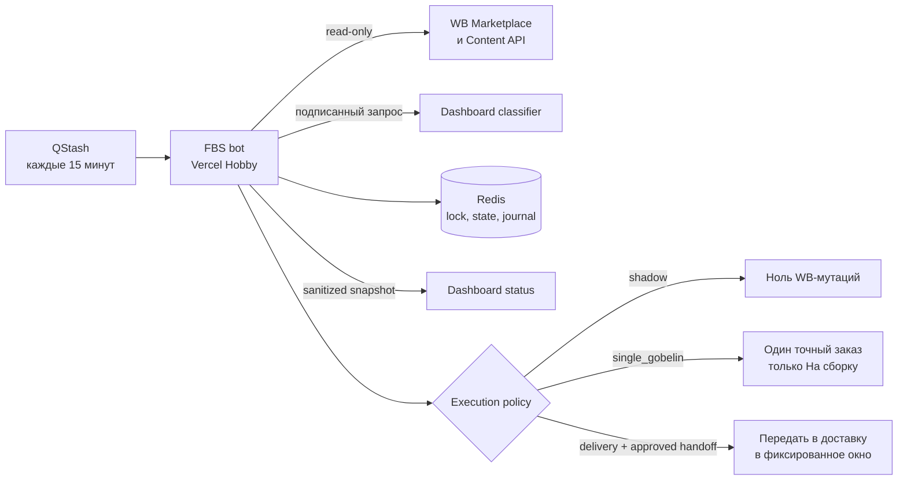

# Отчёт: автономный FBS-бот ИП Зубахина

Дата: 2026-08-12
Риск: R3 для shadow-релиза, R4 для включения реальных WB-мутаций

## Цель и критерии

- Каждые 15 минут читать новые FBS-заказы и классифицировать их по актуальному маппингу Dashboard.
- Группировать только совместимые заказы по товару, ткани, складу, офису назначения и служебным WB-признакам.
- Поддержать фиксированные окна доставки `05:00`, `10:00`, `15:00`, `20:00` по Москве.
- Не обрабатывать blacklist, неизвестные категории, неоднозначные ткани и неподтверждённые требования.
- Перед каждой WB-мутацией вести журнал, а результат подтверждать свежим чтением WB.
- Первый реальный тест ограничить одним выбранным гобеленом и только операцией «На сборку».

## Схема

## Роли

- Оркестратор и интегратор: Codex root agent.
- Реализация: изолированные task-агенты и root agent.
- Независимая проверка: `final_safety_review`, `wb_contract_fix_review`.
- Проверка Dashboard-релиза: `dashboard_release_check`.

## Изменения

- Отдельный Next.js/TypeScript-бот: WB-клиент, классификатор, Redis state machine, mutation journal, reconciliation, QStash route, preflight и регистрация расписания.
- Dashboard: подписанные internal classifier/status endpoints, Redis snapshot и admin-only вкладка состояния.
- Безопасность пилота: `single_gobelin` требует точный `orderId`, свежую классификацию `гобелен`, свежую совместимость и подтверждённую handoff policy.
- Crash recovery: attempt-2 не дублирует неизвестную мутацию, базовый и retry-журналы закрываются только по доказанному результату.
- Схемы базы данных не менялись. Redis использует версионированные записи и CAS; удаление production-данных не выполнялось.

## Проверка

| Проверка | Команда или сценарий | Результат |
|---|---|---|
| Bot logic | `npm test` | VERIFIED: 299/299 |
| Bot types/lint/build | `npx tsc --noEmit && npm run lint && npm run build` | VERIFIED |
| Dashboard logic | `npm run test:unit` | VERIFIED: 55/55 |
| Dashboard lint/build | `npm run lint && npm run build` | VERIFIED |
| Diff integrity | `git diff --check` | VERIFIED |
| Pilot stale mapping | planned/retry order becomes blacklisted | VERIFIED: zero WB writes |
| Active delivery retry | attempt-2 inside active window | VERIFIED |
| Retry crash boundary | failure on second `verified` write | VERIFIED: no third WB mutation |
| Production smoke | admin/auth/classifier/heartbeat and one pilot order | UNVERIFIED: deployment not completed |

Независимый вердикт на bot commit `d363772`: PASS от двух проверяющих, блокирующих находок нет.

## Реестр утверждений

| Утверждение | Статус | Доказательство |
|---|---|---|
| Логика бота соответствует согласованным ограничениям | VERIFIED | 299 тестов и два независимых PASS |
| Dashboard-контракт и admin-only UI работают локально | VERIFIED | 55 тестов, build и предыдущий desktop/mobile smoke |
| Dashboard feature-ветка находится на GitHub | VERIFIED | remote branch `feature/zubakhina-fbs-bot` |
| Bot repository находится на GitHub | UNVERIFIED | приватный repository ещё не создан |
| Production обслуживает нужный commit | UNVERIFIED | Vercel deployment ещё не создан |
| Реальная WB-поставка создана ботом | UNVERIFIED | мутации намеренно выключены |

## Доставка

- Dashboard branch: `feature/zubakhina-fbs-bot`.
- Dashboard commit: `9d933a4`.
- Bot commit: `d363772`.
- Rollback Dashboard: `dafd88ab53cd50074c939656bbc6c8920e931620`.
- PR, CI, Vercel deployment ID и production smoke будут добавлены только после получения фактических подтверждений.

## Ограничения и блокеры

- Физический маршрут сдачи нельзя вывести из `warehouseId`, `officeId` или недокументированных числовых `deliveryType`. Нужен подтверждённый склад/СЦ и список допустимых `officeId`; ПВЗ требует отдельной логики коробов.
- GitHub push доступен по существующей схеме, но для создания приватного bot repository и PR требуется отдельно разрешённое использование сохранённых credentials либо ручное создание этих объектов.
- До настройки Redis, QStash, одинакового shared secret и production env бот не может пройти read-only preflight.
- До успешных shadow preflight/smoke и выбора точного гобеленового `orderId` включение WB-мутаций запрещено.
