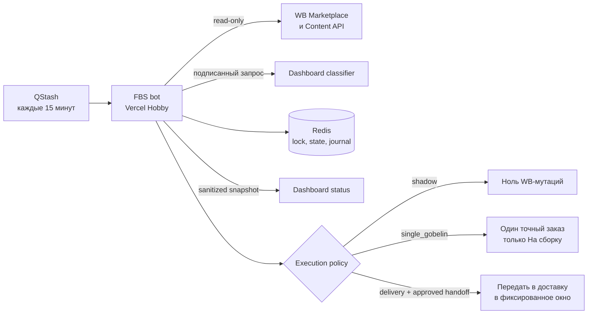

# Отчёт: автономный FBS-бот ИП Зубахина

Дата: 2026-08-12
Риск: R3 для shadow-релиза, R4 для включения реальных WB-мутаций

## Цель и критерии

- Каждые 15 минут читать новые FBS-заказы и классифицировать их по актуальному маппингу Dashboard.
- Группировать только совместимые заказы по товару, ткани, складу, офису назначения и служебным WB-признакам.
- Поддержать фиксированные окна доставки `05:00`, `10:00`, `15:00`, `20:00` по Москве.
- Не обрабатывать blacklist, неизвестные категории, неоднозначные ткани и неподтверждённые требования.
- Перед каждой WB-мутацией вести журнал, а результат подтверждать свежим чтением WB.
- Первый реальный тест ограничить одним выбранным гобеленом и только операцией «На сборку».

## Схема

## Роли

- Оркестратор и интегратор: Codex root agent.
- Реализация: изолированные task-агенты и root agent.
- Независимая проверка: `final_safety_review`, `wb_contract_fix_review`.
- Проверка Dashboard-релиза: `dashboard_release_check`.

## Изменения

- Отдельный Next.js/TypeScript-бот: WB-клиент, классификатор, Redis state machine, mutation journal, reconciliation, QStash route, preflight и регистрация расписания.
- Dashboard: подписанные internal classifier/status endpoints, Redis snapshot и admin-only вкладка состояния.
- Безопасность пилота: `single_gobelin` требует точный `orderId`, свежую классификацию `гобелен`, свежую совместимость и подтверждённую handoff policy.
- Crash recovery: attempt-2 не дублирует неизвестную мутацию, базовый и retry-журналы закрываются только по доказанному результату.
- Схемы базы данных не менялись. Redis использует версионированные записи и CAS; удаление production-данных не выполнялось.

## Проверка

| Проверка | Команда или сценарий | Результат |
|---|---|---|
| Bot logic | `npm test` | VERIFIED: 302/302 |
| Bot types/lint/build | `npx tsc --noEmit && npm run lint && npm run build` | VERIFIED |
| Dashboard logic | `npm run test:unit` | VERIFIED: 55/55 |
| Dashboard lint/build | `npm run lint && npm run build` | VERIFIED |
| Diff integrity | `git diff --check` | VERIFIED |
| Pilot stale mapping | planned/retry order becomes blacklisted | VERIFIED: zero WB writes |
| Active delivery retry | attempt-2 inside active window | VERIFIED |
| Retry crash boundary | failure on second `verified` write | VERIFIED: no third WB mutation |
| Bot production smoke | `/`, `/api/health`, unsigned `/api/qstash/cycle` | VERIFIED: `200`, `200`, `403` |
| Signed shadow cycle | QStash -> Bot -> WB/Redis/Dashboard | VERIFIED: QStash `DELIVERED`, WB mutations `0` |
| Scheduler | one active schedule, Moscow time | VERIFIED: `CRON_TZ=Europe/Moscow */15 * * * *` |

Независимый вердикт на bot commit `d363772`: PASS от двух проверяющих, блокирующих находок нет. Production-патчи проверены полным набором из 302 тестов.

## Результат первого shadow-цикла

| Состояние | Количество |
|---|---:|
| Новые заказы WB | 84 |
| Пригодны для группировки | 64 |
| Исключены blacklist | 15 |
| Заблокированы из-за ткани | 5 |
| Созданные поставки | 0 |
| WB-мутации | 0 |

Heartbeat опубликован на Dashboard. Пять ошибок `blocked_unknown_fabric` выведены как блокирующие; скрытого продолжения обработки таких заказов нет. Среди свежих данных найдено 55 гобеленов, из них 45 имеют подтверждённую совместимость с СЦ Курск (`officeId=210`).

## Результат single-gobelin пилота

- Создана одна поставка `WB-GI-264226447`; повторная поставка не создавалась.
- В существующую поставку добавлен только заказ `5469938841`.
- Свежая проверка WB: `supplierStatus=confirm`, состав поставки `[5469938841]`, `done=false`, `destinationOfficeId=210`, `cargoType=1`.
- Create и assignment journal имеют состояние `verified`; поставка `open_verified`, заказ `assigned_verified`.
- Передача в доставку не выполнялась.
- После пилота production возвращён в `shadow`, mutations выключены, pilot ID удалён; контрольный shadow-цикл не создал новых журналов.

Первый вызов выявил реальный WB-контракт: новая пустая поставка возвращает `cargoType=0` до добавления первого заказа. Бот безопасно остановился, не создал дубль и оставил заказ новым. Коммит `74e5816` трактует ноль как незаполненное значение только при доказанной пустой поставке; настоящее несовпадающее значение, например `cargoType=2`, по-прежнему блокирует операцию.

## Реестр утверждений

| Утверждение | Статус | Доказательство |
|---|---|---|
| Логика бота соответствует согласованным ограничениям | VERIFIED | 302 теста и два независимых PASS |
| Dashboard-контракт и admin-only UI работают локально | VERIFIED | 55 тестов, build и предыдущий desktop/mobile smoke |
| Dashboard feature доставлена в `main` | VERIFIED | PR #1, merge commit `f8c10df` |
| Bot repository находится на GitHub | VERIFIED | private `Alex22451/wb-fbs-bot-zubakhina` |
| Production обслуживает нужный bot commit | VERIFIED | `74e5816`, deployment `dpl_E2SdAsJaf2NEjBLGQgt3v5SLyvdQ` |
| Dashboard и bot используют один rotating shared secret | VERIFIED | signed status publication без `dashboard_status_failed` |
| Реальная WB-поставка создана ботом | VERIFIED | `WB-GI-264226447`, один подтверждённый заказ |
| Реальная передача в доставку выполнена | UNVERIFIED | не входила в пилот и осталась выключена |

## Доставка

- Dashboard PR: `https://github.com/Alex22451/wb-dashboard/pull/1`.
- Dashboard production commit: `f8c10df`.
- Dashboard deployment: `dpl_93KCBHtGmgrmqt7MYxFM74VQzinL`, alias `https://svodkasobag.vercel.app`.
- Bot repository: `https://github.com/Alex22451/wb-fbs-bot-zubakhina`.
- Bot production commit: `74e5816`.
- Bot deployment после возврата в shadow: `dpl_E2SdAsJaf2NEjBLGQgt3v5SLyvdQ`, alias `https://wb-fbs-bot-zubakhina.vercel.app`.
- Upstash resources: `zubakhina-fbs-redis` и `zubakhina-fbs-qstash`, оба `Available`, free plan.
- Scheduler ID: `zubakhina-fbs-cycle-v1`, один активный экземпляр без дублей.
- Rollback Dashboard: `dafd88ab53cd50074c939656bbc6c8920e931620`.

## Ограничения и блокеры

- Подтверждённый маршрут пилота: склад продавца `776735` -> СЦ Курск `officeId=210`. Другие office ID автоматически не разрешаются.
- Локальный `preflight` не может скачать из Vercel значения типа `Sensitive`; поэтому production-конфигурация проверена через подписанный QStash-вызов в реальной среде.
- Пилотный заказ `5469938841` успешно поставлен на сборку в `WB-GI-264226447`; его повторная обработка запрещена состоянием и журналом.
- Текущий режим: `shadow`, `FBS_MUTATIONS_ENABLED=false`, `FBS_ASSEMBLY_SCOPE=disabled`.

## Расширение на весь маппинг: 2026-08-13

Риск: R3 для деплоя и поэтапного запуска; ранее данное пользователем точное разрешение покрывает автоматические WB-операции «На сборку» и «Передать в доставку» для ИП Зубахина.

### Цель и критерии

- Обрабатывать все товары, разрешённые актуальным Dashboard-мэппингом, и по-прежнему не трогать blacklist.
- Для внутренних и декоративных подушек извлекать один однозначный размер только из уже полученного артикула поставщика и разделять поставки по виду и размеру.
- Собирать заказы каждые 15 минут, а передавать в доставку только в окнах `08:00` и `17:00` по Москве.
- При недоступности Dashboard разрешать кэш только для отображения состояния, но не для WB-мутаций.
- Ограничить один цикл пятью assembly work-items, 100 заказами на группу и 500 новыми заказами; доставка отдельно ограничена 50 поставками.

### Изменения

- Dashboard возвращает `blocked_unknown_size` для подушки без одного подтверждённого размера. Размер входит в `productType`, поэтому уже существующее измерение группы разделяет подушки без новой схемы данных.
- Версия семантики маппинга изменена на `sized-pillows-v2`, чтобы старый кэш без размеров не считался актуальным.
- Все 19 элементов blacklist покрыты нормализованным табличным тестом.
- Бот различает классификацию `live_dashboard` и `cache_fallback`; только live-ответ текущего цикла авторизует planned, retry и new assembly.
- Окна доставки переведены на `08:00` и `17:00` с московскими календарными границами. Старые ключи `05/10/15/20` не переписываются и могут быть обработаны только более поздним допустимым окном.
- Reconciliation, planned recovery, controlled retry и новые группы используют общий детерминированный бюджет из пяти assembly work-items; приоритет отдан восстановлению.
- Новая работа сортируется детерминированно и ограничена пятью группами, 100 заказами на группу и 500 заказами за цикл. План доставки хранит полный неизменяемый набор кандидатов, обрабатывая не более 50 за цикл.
- Схема базы данных не менялась; API-ключи и секреты не читались, не изменялись и не добавлялись в diff.

### Проверка

| Проверка | Команда или сценарий | Результат |
|---|---|---|
| Dashboard logic | `npm run test:unit` | VERIFIED: 62/62 |
| Dashboard lint/build | `npm run lint && npm run build` | VERIFIED |
| Bot logic | `npm test` | VERIFIED: 340/340 |
| Bot lint/types/build | `npm run lint && npx tsc --noEmit && npm run build` | VERIFIED |
| Diff integrity | `git diff <base>..HEAD --check` в обоих репозиториях | VERIFIED |
| Secret diff scan | поиск JWT и присваиваний token/secret в обоих diff | VERIFIED: совпадений нет |
| Dashboard outage | свежий WB-заказ + пригодный кэш + ошибка Dashboard | VERIFIED: локальное состояние обновляется, WB assembly mutations = 0 |
| Live remap/blacklist | старый пригодный кэш заменён live-ответом | VERIFIED: используется только новый live-результат |
| Общий assembly budget | unresolved + planned + retry + new в одном цикле | VERIFIED: максимум 5 work-items, продолжение детерминировано |
| Pillow split | одинаковый/разный размер и вид подушки | VERIFIED: одинаковые объединяются, разные разделяются |
| Delivery calendar | границы, grace hour, rollover и legacy retry | VERIFIED для локальной логики `08:00`/`17:00` MSK |

Первый независимый финальный review вернул `FAIL`: кэш мог считаться свежим разрешением, а recovery не имел общего бюджета. После исправления `2ef1749` повторный независимый review диапазонов Dashboard `82c237a..7c51d69` и bot `3663929..2ef1749` вернул `PASS WITH RISKS`; блокирующих находок нет.

### Реестр утверждений расширения

| Утверждение | Статус | Доказательство |
|---|---|---|
| Все разрешённые Dashboard категории проходят общий FBS-контракт | VERIFIED | полный список primary mappings и 62 Dashboard tests |
| Blacklist не разрешает FBS-обработку | VERIFIED | табличный тест всех 19 элементов |
| Размер подушки не создаёт дополнительный WB API-запрос | VERIFIED | размер берётся из уже загруженного Content card article |
| Кэш Dashboard не разрешает assembly mutation | VERIFIED | provenance gate и outage regression tests |
| Один цикл ограничен общим assembly budget | VERIFIED | shared budget regression tests |
| Код опубликован в GitHub `main` | UNVERIFIED | выполняется после этого отчёта |
| Production обслуживает требуемые SHA | UNVERIFIED | проверяется после деплоя |
| Реальный all-products assembly smoke успешен | UNVERIFIED | выполняется поэтапно после shadow smoke |
| Передача в доставку в новом окне успешна | UNVERIFIED | первое допустимое production-окно после активации |

### Доставка и откат расширения

- Dashboard feature commit до отчёта: `7c51d693d5b8618195dcd38102e1eb9d1d94ad76`.
- Bot feature commit: `2ef1749cf81b40746d6fb4393405d60b04cd6864`.
- Rollback Dashboard: `82c237adf376c8ab6ac083e7e84455b287f60223`.
- Rollback bot: `36639292e7e902f1dfec706ced83e38c0a912128`.
- Порядок: Dashboard в production, bot в `shadow`, cross-project smoke, bounded assembly, проверка журналов, затем delivery.

### Остаточные риски

- Общий бюджет считает логические work-items, а не отдельные WB read calls внутри одной сверки. Одна необычно дорогая create-reconciliation может приблизиться к лимиту функции или seller lock.
- Неразрешённые delivery-журналы сверяются до отдельного лимита 50 кандидатов окна. Перед unattended delivery необходимо убедиться, что такой хвост мал, и наблюдать длительность цикла.
- До production smoke утверждения о работающем all-products assembly и первом окне `08:00`/`17:00` остаются `UNVERIFIED`.
